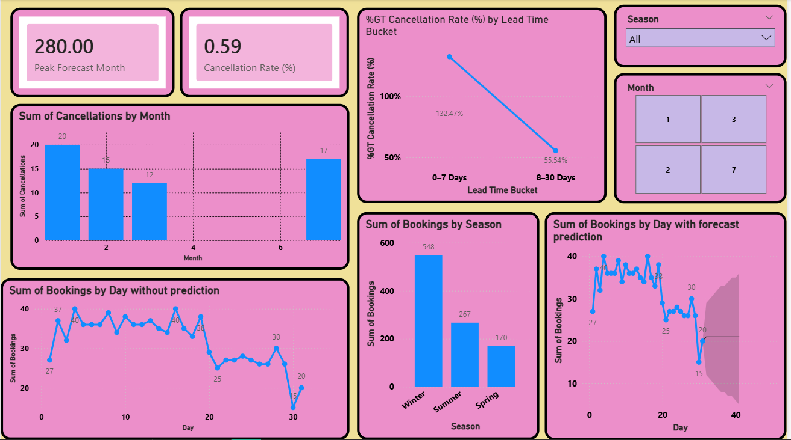

# Hotel Revenue Analysis – Milestone 3

## Project Overview
Milestone 3 focuses on **advanced analysis and forecasting** of hotel bookings using **Power BI**.  
This milestone extends previous work by adding **forecasting, KPIs, and trend-based insights** to support better business decision-making.

---

## Dashboard Preview

---

## Key Objectives
- Forecast future hotel bookings  
- Analyze booking and cancellation trends  
- Identify peak demand periods  
- Track important KPIs for planning  

---

## Dashboard Highlights
The dashboard provides insights into:

- **Peak Forecast Month** – Month with the highest predicted bookings  
- **Cancellation Rate (%)** – Average cancellation percentage  
- **Bookings by Day (Actual)** – Daily booking trend without prediction  
- **Bookings by Day (With Forecast)** – Actual data with future forecast  
- **Cancellations by Month** – Monthly cancellation comparison  
- **Cancellation Rate by Lead Time Bucket** – Effect of booking lead time on cancellations  

---

## Forecasting & Analysis
- Time-based trends are used to predict future bookings  
- Forecast visuals help identify upcoming demand  
- Comparison of actual vs predicted bookings improves planning accuracy  

---

## Filters Used
- **Season** – Seasonal analysis of bookings  
- **Month** – Month-wise trend exploration  

---

## Tools & Technologies
- **Power BI** – Data visualization and forecasting  
- **DAX** – Measures and KPIs  
- **Star Schema** – Optimized data model  

---

## Key Learnings
- Forecasting helps anticipate high-demand periods  
- Longer lead times show higher cancellation impact  
- KPIs simplify performance tracking  
- Predictive insights support revenue optimization  

---

## Conclusion
Milestone 3 introduces predictive analytics to help hotels forecast demand, manage cancellations, and improve revenue planning using data-driven insights.
